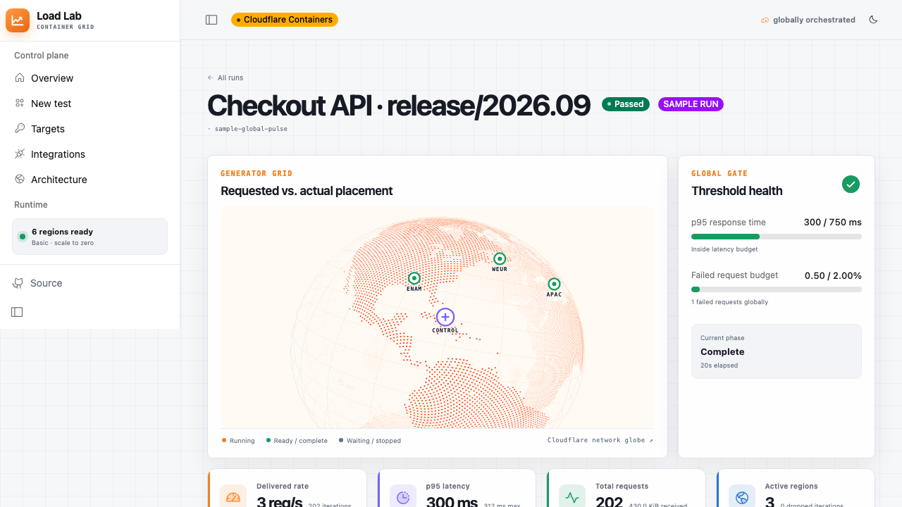

# Load Lab

Global, self-hosted load testing powered by Cloudflare Containers.

**Live app:** [cloudflare-load-lab.dwarven.workers.dev](https://cloudflare-load-lab.dwarven.workers.dev)



Load Lab takes one declarative traffic budget, partitions it exactly across regional generator shards, warms a k6 process in each selected placement pool, and starts every process behind a shared barrier. A Durable Object merges counters and latency histograms while the Kumo dashboard follows the run.

> Experimental garden project, not an official Cloudflare product. Only test systems you own or are explicitly authorized to test.

## What works

- Strict Container placement pools for `ENAM`, `WNAM`, `WEUR`, `EEUR`, `APAC`, and `SAM`
- `ramping-arrival-rate` and `ramping-vus` k6 executors
- Multi-step HTTP tasks with checks and think time
- Exact largest-remainder distribution so shard count never multiplies requested load
- Container readiness barrier and synchronized start timestamp
- Live request, failure, VU, dropped-iteration, and mergeable latency metrics
- Global p95/error thresholds with pass/fail status
- D1 run/target index and R2 JSON reports
- Atomic global and per-region generator capacity reservations
- Bounded public demo and owner-only custom runs
- Target ownership challenge plus per-Container hostname allowlists
- Kumo React dashboard, configuration wizard, target manager, and architecture view
- YAML/JSON CLI with JUnit output, idempotency keys, GitHub Actions, and GitLab CI examples

## Architecture

```text
UI / CLI / CI
      │
      ▼
Worker API ── D1 run index
      │       R2 reports
      ▼
RunCoordinator Durable Object
      │
      ├── ENAM Container DO ─┐
      ├── WNAM Container DO ─┤
      ├── WEUR Container DO ─┤
      ├── EEUR Container DO ─┼── k6 ──► verified target
      ├── APAC Container DO ─┤
      └── SAM  Container DO ─┘
                    │
                    └── one-second metric batches ──► Worker ──► coordinator
```

Placement is regional, not exact-city synthetic monitoring. The UI always separates the requested pool from `CLOUDFLARE_REGION` and `CLOUDFLARE_LOCATION` reported by the actual Container. Results represent Cloudflare's network, not residential last-mile conditions.

See [docs/architecture.md](docs/architecture.md) and [docs/threat-model.md](docs/threat-model.md).

## Prerequisites

- Node.js 22 or newer
- Go 1.25 or newer
- Docker-compatible daemon
- Cloudflare account with Workers Paid and Containers access
- Wrangler authenticated with Workers, Containers, D1, and R2 permissions

## Local development

```bash
npm install
npm run db:migrate:local
cp .dev.vars.example .dev.vars
# Set ADMIN_TOKEN to a random value.
npm run dev
```

Wrangler builds all six local Container applications, so Docker must be running. For client-only UI work that does not start the Worker or Containers:

```bash
npm run dev:client
# http://localhost:5174/preview renders a deterministic sample run.
```

Run all checks:

```bash
npm run check
```

The generator can also be validated independently:

```bash
cd generator
go test ./...
docker build --platform linux/amd64 -t loadlab-generator .
```

## Provision a deployment

1. Create a D1 database and replace `database_id` in `wrangler.jsonc`:

   ```bash
   npx wrangler d1 create cloudflare-load-lab --location enam
   ```

2. Create the report bucket and update its name if necessary:

   ```bash
   npx wrangler r2 bucket create cloudflare-load-lab-artifacts
   ```

3. Apply migrations:

   ```bash
   npm run db:migrate:remote
   ```

4. Add an administrator token:

   ```bash
   openssl rand -hex 32 | npx wrangler secret put ADMIN_TOKEN
   ```

5. Review public-demo budgets and regional `max_instances` values, then deploy:

   ```bash
   npm run deploy
   ```

Inactive Containers scale to zero. `max_instances` is a deploy-time ceiling, not an autoscaling target.

## Run configuration

```yaml
version: 1
name: checkout-pr
targetId: your-verified-target-id

tasks:
  - name: health
    method: GET
    path: /api/health
    headers: {}
    expectedStatusMin: 200
    expectedStatusMax: 299
    thinkTimeMs: 0

profile:
  mode: arrival-rate
  initialTarget: 5
  maxVus: 200
  stages:
    - { durationSeconds: 30, target: 100 }
    - { durationSeconds: 60, target: 100 }
    - { durationSeconds: 30, target: 5 }

regions:
  - { code: ENAM, weight: 40, shards: 1 }
  - { code: WEUR, weight: 30, shards: 1 }
  - { code: APAC, weight: 30, shards: 1 }

thresholds:
  p95Ms: 300
  errorRate: 0.01
```

`arrival-rate` targets iterations per second. Each iteration executes every listed task, so a flow with three tasks can produce up to three HTTP requests per iteration.

## CLI and CI

From this repository:

```bash
node packages/cli/bin/loadlab.js plan examples/configs/smoke.yml
LOADLAB_API_URL=https://your-worker.example \
LOADLAB_TOKEN=... \
node packages/cli/bin/loadlab.js run examples/configs/smoke.yml \
  --wait --junit load-lab.xml --idempotency-key "$CI_PIPELINE_ID"
```

While waiting, the CLI catches `SIGINT`/`SIGTERM` and requests remote cancellation before exiting.

Exit codes:

- `0`: global thresholds passed
- `2`: execution completed but a threshold failed
- `3`: cancelled or infrastructure error
- `1`: validation/API/CLI failure

See [`examples/github-actions`](examples/github-actions) and [`examples/gitlab-ci`](examples/gitlab-ci).

## Safety model

Anonymous users can only launch a server-owned 20-second scenario against `/api/demo-target`. Custom runs require an administrator token and either:

- a target that serves the generated challenge at `/.well-known/cloudflare-load-lab.txt`, or
- an exact hostname listed by the operator in `ALLOWED_TARGET_HOSTS`.

The Worker rejects local/private-looking origins, disables task redirects, caps duration/load/shards, reserves global capacity atomically, and programs each Container with only its target and callback host. See the threat model for limitations.

## Metrics accuracy

The generator consumes k6's JSON point output into fixed latency buckets. Fixed buckets are mergeable across independent generators; percentile results are reported as the conservative upper bound of the selected bucket. This avoids the invalid practice of averaging regional p95 values. JSON point output is intentionally an MVP tradeoff and should be benchmarked before raising per-shard throughput caps substantially.

## License and dependencies

Original Load Lab source is MIT licensed. The Container image includes unmodified [Grafana k6](https://github.com/grafana/k6), distributed under AGPL-3.0; see `generator/NOTICE` and comply with its distribution terms. The UI uses Cloudflare's `@cloudflare/kumo` package and locally vendors Cloudflare's published network-globe artwork. See [`THIRD_PARTY_NOTICES.md`](THIRD_PARTY_NOTICES.md).
