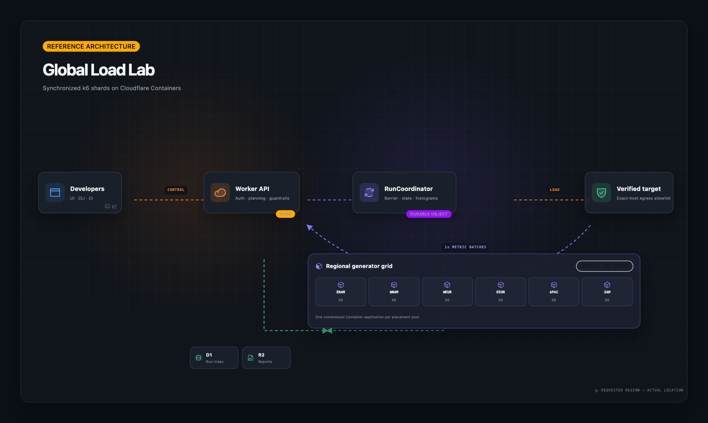

# Architecture

## Control plane

The Worker serves the React/Kumo SPA and a versioned JSON API. D1 is the queryable run and target index; the authoritative live state belongs to one `RunCoordinator` Durable Object per run. R2 stores immutable final snapshots.

A singleton `BudgetCoordinator` Durable Object owns active leases, daily demo usage, and total/per-region generator reservations. The edge Rate Limiting binding is a cheap anonymous filter; the Budget Coordinator is the authoritative concurrency and capacity check.

## Regional generator pools

Container placement constraints are application-level. Load Lab therefore exports six Container Durable Object classes backed by the same image rather than pretending an individual instance can select an arbitrary region:

- `GeneratorENAM`
- `GeneratorWNAM`
- `GeneratorWEUR`
- `GeneratorEEUR`
- `GeneratorAPAC`
- `GeneratorSAM`

The initiating Durable Object also receives the corresponding location hint. The actual location reported by the Container runtime remains authoritative.

## Planning

For every region, its configured weight is divided among its shards. Every integer stage target is then allocated with the largest-remainder method. The local stage targets always sum to the requested global target; increasing shard count cannot multiply traffic.

The run coordinator starts each Container, programs an exact outbound hostname allowlist, and calls `/prepare`. Once all agents report ready, it chooses a timestamp three seconds in the future and calls `/start` on every shard. Cold-start time is not included in test metrics.

## Generator

The non-root Go agent owns the k6 child process and exposes only fixed control endpoints. It generates JavaScript from the validated declarative task model; users cannot provide shell arguments. k6 emits JSON points to an ephemeral file, which the agent tails into one-second deltas.

Latency points enter fixed buckets. Counters and bucket counts sum in the Durable Object. Gauges such as active VUs replace the prior value for each assignment. Duplicate batches are discarded by assignment sequence number.

## Completion and failure

A run is complete only when every assignment is terminal. The coordinator evaluates global thresholds, writes an R2 snapshot, updates D1, and releases the budget lease. Alarms terminate a run that exceeds its planned duration plus a grace period. Stop requests signal the agent first and then terminate the Container.

Container startup is currently fanned out in batches of six to respect outgoing connection pressure. Queue-backed fan-out is the intended next step for deployments that raise the 12-shard application cap.
